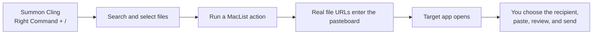

<p align="center">
  <strong>MacList Actions</strong>
</p>

<p align="center">
  <strong>Find the file. Hand it off. You press Send.</strong>
</p>

<p align="center">
  An unofficial, local-first action layer for
  <a href="https://github.com/FuzzyIdeas/Cling">Cling</a> on macOS.
</p>

<p align="center">
  <a href="https://github.com/xffighting/maclist-actions/actions/workflows/ci.yml"></a>
  <a href="https://github.com/xffighting/maclist-actions/releases/latest"></a>
  
  <a href="LICENSE"></a>
  <a href="#safety-by-design"></a>
</p>

<p align="center">
  <a href="#30-second-install">Quick start</a> ·
  <a href="#safety-by-design">Safety model</a> ·
  <a href="docs/README.zh-CN.md">简体中文</a>
</p>

> [!IMPORTANT]
> This is an unofficial community project. It does not bundle Cling and is not affiliated with FuzzyIdeas, The Low-Tech Guys, Tencent, DingTalk, Mozilla, or Listary. Cling custom Scripts may require Cling Pro or an active trial.

## The five-second workflow



No folder hunting. No upload service. No automated send.

## Actions

| Action | Main-window shortcut | Result | Automatic send? |
|---|---:|---|---:|
| WeChat handoff | Control + Command + W | Copies real files and opens WeChat | No |
| DingTalk handoff | Control + Command + D | Copies real files and opens DingTalk | No |
| Thunderbird handoff | Control + Command + E | Copies real files and opens Thunderbird | No |
| Copy file checklist | Control + Command + L | Copies filenames and absolute paths as text | No |

Inside Cling's **Execute script** picker, the single-letter keys W, D, E, and L also work.

## Why this exists

Finding a document is often only half the job. The slow part is what comes next:

1. reveal it in Finder;
2. drag it into another app;
3. find the right chat or draft;
4. verify that a real attachment—not path text—was inserted.

MacList Actions compresses the first two steps into one explicit action and deliberately leaves the final send under human control.

## 30-second install

### Requirements

- macOS 14 or newer.
- Official [Cling 2.6.5](https://github.com/FuzzyIdeas/Cling/releases/tag/v2.6.5), preferably installed at `/Applications/Cling.app`.
- **Cling Pro or an active trial for custom Scripts.**
- At least one destination app if you want its handoff action. WeChat, DingTalk, and Thunderbird are independent and optional.

### Install

```bash
git clone https://github.com/xffighting/maclist-actions.git
cd maclist-actions
./install.sh
./doctor.sh
```

Restart Cling after installation. The installer verifies Cling's version, bundle identifier, Developer ID signature, and signing team before writing anything.

If you are using this directory inside a Cling source checkout, run the same commands with the `Customization/` prefix.

## Use it

1. Press **Right Command + /** to open Cling.
2. Search for and select one or more files.
3. Choose an action in the Scripts row, or press its Control + Command shortcut.
4. Select a chat or create an email in the destination app.
5. Press **Command + V**.
6. Review the attachment and recipient, then send it yourself.

## Safety by design

The code in this repository:

- never chooses a contact, chat, or recipient;
- never presses paste or Send;
- writes macOS `NSURL` file objects to the pasteboard, not merely path text;
- does not read file contents;
- contains no network client;
- stores rollback state in a private `0700` directory;
- snapshots same-name scripts, six changed preferences, and the original Scripts-directory mode;
- stops on unexpected Cling version, bundle ID, signing team, symlinked script directory, or post-install edits.

The pasteboard retains file URLs until another app replaces them. If a destination app is missing, the file may still already be on the pasteboard.

These guarantees cover only this repository's scripts. Cling, Sparkle, Paddle, WeChat, DingTalk, and Thunderbird have their own behavior and policies. The installer disables Cling's Sentry preference but does not remove Cling's updater or licensing components.

## Verify and roll back

Run the complete local checks:

```bash
./test.sh
./doctor.sh
./acceptance.sh /path/to/a/known/file
```

`test.sh` temporarily replaces the pasteboard during its full local mode. CI uses an explicit no-UI mode and does not touch the pasteboard.

Remove the customization layer:

```bash
./uninstall.sh
```

Rollback restores pre-existing same-name scripts, changed Boolean preferences, and the original Scripts-directory mode. Cling and its search index remain installed. Running the uninstaller without installation state changes nothing.

## How it works

- A small JXA helper converts selected paths into native `NSURL` objects.
- `NSPasteboard.writeObjects` exposes both `public.file-url` and `NSFilenamesPboardType`.
- Each action opens its destination with macOS `open -a`.
- Cling watches its Application Scripts directory and renders eligible scripts in the action row.
- The textual checklist is the only action that copies path text.

There is no background daemon, cloud account, API key, or content index in MacList Actions.

## Validation snapshot

The v0.1.0 acceptance run verified:

- real file-URL pasteboard types;
- WeChat opening without paste or send;
- optional app detection for WeChat, DingTalk, and Thunderbird;
- idempotent install;
- safe refusal after local script edits;
- restore of original scripts, preferences, and directory mode;
- no-state uninstall safety;
- 20-query local P95 roundtrip of 24.0 ms with 283,348 loaded Cling index entries.

The timing is one machine's observed result, not a cross-device performance guarantee. See [ACCEPTANCE.md](ACCEPTANCE.md) for the full boundary.

## FAQ

<details>
<summary><strong>Is this a standalone Listary alternative?</strong></summary>

Not yet. v0.1 is an action layer for Cling. Cling provides the global launcher, index, search, preview, and selection UI.
</details>

<details>
<summary><strong>Does it require Cling Pro?</strong></summary>

Cling's custom Scripts feature may require Pro or an active trial. This dependency is disclosed up front because the MIT license for this repository does not make Cling's paid features free.
</details>

<details>
<summary><strong>Does it upload or send my files?</strong></summary>

The scripts in this repository do neither. They put local file URLs on the pasteboard and open another app. You choose the destination, paste, review, and send.
</details>

<details>
<summary><strong>Why can Cling not find a protected file?</strong></summary>

Cling's scopes and macOS privacy permissions determine what it can index. Grant Full Disk Access only if you want Cling to search protected locations such as Mail-related data.
</details>

<details>
<summary><strong>Why not publish a modified Cling binary?</strong></summary>

The public Cling v2.6.5 project references a local WarpDrop package and includes dependencies or binary artifacts whose downstream source and licensing closure could not be independently verified. This repository therefore ships only original action-layer code and points users to the official Cling release.
</details>

<details>
<summary><strong>Does it support Windows?</strong></summary>

No. The current implementation uses macOS AppKit pasteboard types, JXA, and `open -a`.
</details>

## Roadmap

- [ ] Add actions through a documented five-minute template.
- [ ] Support Apple Mail and more explicit compose flows without auto-send.
- [ ] Add configurable app names and shortcut conflict checks.
- [ ] Publish a privacy-safe demo with synthetic filenames.
- [ ] Explore a standalone native search core that does not depend on Cling Pro.
- [ ] Research a Windows adapter after the macOS workflow is stable.

## Contributing

Start with [CONTRIBUTING.md](CONTRIBUTING.md). Every new action must declare:

- its target application;
- its shortcut;
- whether it reads content or uses the network;
- whether it can paste or send;
- its rollback behavior.

Small, local-first actions make good first issues.

## Attribution and license

MacList Actions is MIT-licensed original code. Cling is a separate GPL-3.0 project and is not included. See [NOTICE.md](NOTICE.md) and [COMPLIANCE.md](COMPLIANCE.md).

If the workflow saves you from one more Finder-to-chat drag, consider starring the repository so other Mac users can find it.
