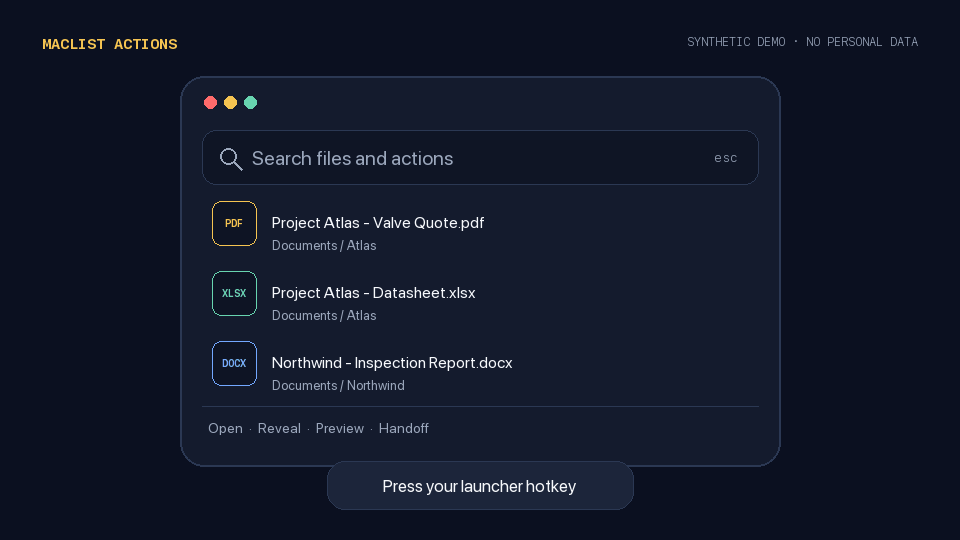

# MacList

**快速找回文件，交给目标应用；最后一步仍由你决定。**

[English](../README.md) · [项目 Dashboard](https://xffighting.github.io/maclist-actions/project-dashboard.html) · [最新版本](https://github.com/xffighting/maclist-actions/releases/latest)



> [!IMPORTANT]
> MacList v0.2.0 有两条明确分开的路线：**Cling Actions 是稳定可用的文件交接层；Standalone Core 是开发者预览版 CLI/Swift 库，不是已经完成的“Mac 版 Listary”，也还不是签名的 Mac App。**

## 先选路线

| 路线 | 状态 | 适合什么 | 需要 Cling 吗 |
|---|---|---|---:|
| **Cling Actions** | **Stable / 稳定版** | 用 Cling 找到文件，一键复制真实附件并打开目标应用 | 需要；自定义 Scripts 可能需要 Cling Pro 或试用 |
| **Standalone Core** | **Developer Preview / 开发者预览** | 只为明确授权的目录建立本地元数据索引，并在命令行模糊搜索 | 不需要 |

两条路线服务同一个方向：让过去的资料更容易找回和复用。但它们目前还没有合并成一款独立的图形界面应用。

## 稳定路线：Cling Actions

找到资料以后，常见的麻烦是还要打开 Finder、拖到微信或邮件、再确认是不是一个真正的附件。MacList Actions 把中间这段缩成一个动作：

1. 在 Cling 里搜索并选中文件；
2. 运行 MacList 动作；
3. MacList 把真实文件 URL 放入剪贴板，并打开目标应用；
4. 你自己选择聊天或邮件，按 **Command + V**，检查后发送。

不上传文件，不自动选择对象，不自动发送。

### 动作与快捷键

| 动作 | 快捷键 | 结果 | 自动发送？ |
|---|---:|---|---:|
| 微信 | `⌃⌘W` | 复制真实文件并打开微信 | 否 |
| 钉钉 | `⌃⌘D` | 复制真实文件并打开钉钉 | 否 |
| Thunderbird | `⌃⌘E` | 复制真实文件并打开 Thunderbird | 否 |
| Apple Mail | `⌃⌘M` | 复制真实文件并打开 Apple Mail | 否 |
| Microsoft Outlook | `⌃⌘O` | 复制真实文件并打开 Outlook | 否 |
| 资料清单 | `⌃⌘L` | 复制文件名和完整路径文字 | 否 |

在 Cling 的 **Execute script** 面板中，也可以按单字母 `W`、`D`、`E`、`M`、`O` 或 `L`。

### 安装稳定动作

需要：

- macOS 14 或更高版本；
- 官方 [Cling 2.6.5](https://github.com/FuzzyIdeas/Cling/releases/tag/v2.6.5)；
- 如果 Cling 对自定义 Scripts 有要求，需要 Pro 或仍有效的试用期；
- 只需安装你实际使用的目标应用。

```bash
git clone https://github.com/xffighting/maclist-actions.git
cd maclist-actions
./install.sh
./doctor.sh
```

安装后重启 Cling，按 **右 Command + /** 打开入口。安装器会先核对 Cling 版本、Bundle ID、Developer ID 签名和 Team ID，异常时停止。

验证和卸载：

```bash
./test.sh
./doctor.sh
./acceptance.sh /path/to/a/known/file
./uninstall.sh
```

本机完整测试会临时覆盖剪贴板，CI 使用无 UI 模式。卸载会恢复安装前记录的同名脚本、六项偏好和 Scripts 目录权限，不删除 Cling 或其搜索索引。

## 预览路线：Standalone Core

[`standalone/`](../standalone/) 是不依赖 Cling 的 Swift 文件名和路径搜索底座。它只索引你通过 `--root` 明确传入的目录，只在本机保存元数据，并提供确定性的模糊搜索。

```bash
cd standalone
swift run maclist index --root "$HOME/Documents" --root "$HOME/Downloads"
swift run maclist search "季度报价"
swift run maclist doctor
```

它现在是供开发、测试和验证方向使用的 **CLI + Swift 库**，还没有菜单栏 App、全局快捷键、搜索窗口、实时文件更新、预览和动作联动。完整边界见 [Standalone Core 说明](../standalone/README.md)。

## 隐私边界

MacList 自有代码遵循以下边界：

- 没有文件上传、遥测客户端、账号或 API Key；
- 动作脚本和独立索引器都不读取文件正文；
- 独立核心只扫描用户明确传入的根目录；
- 独立核心默认跳过隐藏项、包内容和符号链接；
- 附件交接写入的是原生文件 URL，不是路径文字；
- 不自动选择联系人、聊天、草稿，不执行粘贴和发送；
- 自有私密状态使用受限的本机文件权限。

剪贴板中的文件 URL 会保留到下一次被覆盖；即使目标应用不存在，所选文件也可能已经进入剪贴板。Cling 和微信、钉钉、邮件客户端等第三方软件有自己的行为与隐私政策，本页承诺只覆盖 MacList 自有代码。

## 为什么保留两条路线

稳定动作层先解决“已经找到了，怎么快速复用”的现实问题；独立核心则从明确授权目录和纯本地元数据开始，为未来原生搜索应用建立可验证的基础。分开标注，可以现在交付真实价值，也不会把尚未完成的 CLI 包装成完整桌面产品。

## 项目地图

| 位置 | 内容 |
|---|---|
| `scripts/` | 稳定的 Cling 文件交接动作与原生剪贴板助手 |
| `standalone/` | 开发者预览版 Swift 搜索核心和 CLI |
| `tools/` | 可重复生成的演示素材与媒体隐私检查 |
| [项目 Dashboard](https://xffighting.github.io/maclist-actions/project-dashboard.html) | 可交互查看项目状态、任务、时间线与决策 |
| [ACCEPTANCE.md](../ACCEPTANCE.md) | 验收证据与产品边界 |
| [COMPLIANCE.md](../COMPLIANCE.md) | 分发范围与上游隔离说明 |

演示 GIF 全部使用合成文件名，没有录制真实桌面、账号、收件人或本机私密路径。

## 常见问题

### 这是完整的“Mac 版 Listary”吗？

不是。稳定路线仍由 Cling 提供全局入口、索引、搜索、预览和结果选择；独立路线目前只是 CLI/Swift 库开发者预览。

### 会上传或自动发送文件吗？

MacList 自有代码不会。稳定动作只把本地文件 URL 放入剪贴板并打开目标应用；你自己选择对象、粘贴、检查和发送。

### 为什么不直接发布修改版 Cling？

Cling v2.6.5 的公开工程含本地 WarpDrop 引用，以及尚未完成下游源码和许可证闭环的依赖或二进制。因此本仓库只发布自有代码，并引导用户安装官方 Cling。

### 支持 Windows 吗？

当前不支持。稳定动作使用 macOS AppKit 剪贴板、JXA 和 `open`；独立 Swift 包也以 macOS 为目标。

## 下一步

- [ ] 把独立核心装进签名的原生 Mac 搜索窗口；
- [ ] 增加用户可见的授权目录管理和可选实时更新；
- [ ] 在不自动发送的前提下连接搜索结果与现有交接动作；
- [ ] 增加快捷键配置和冲突检查；
- [ ] macOS 工作流稳定后，再研究 Windows 适配。

## 参与贡献

阅读 [CONTRIBUTING.md](../CONTRIBUTING.md)。每个新动作都必须写清目标应用、快捷键、联网和正文读取情况、是否可能粘贴或发送，以及回滚方式。

MacList 自有代码采用 MIT 许可证。Cling 是单独的 GPL-3.0 项目，本仓库不包含它，也不隶属于 FuzzyIdeas、The Low-Tech Guys、腾讯、钉钉、Mozilla、Microsoft、Apple 或 Listary。

如果它确实少让你拖拽一次 Finder 文件，可以点一个 Star，让更多 Mac 用户找到它。
